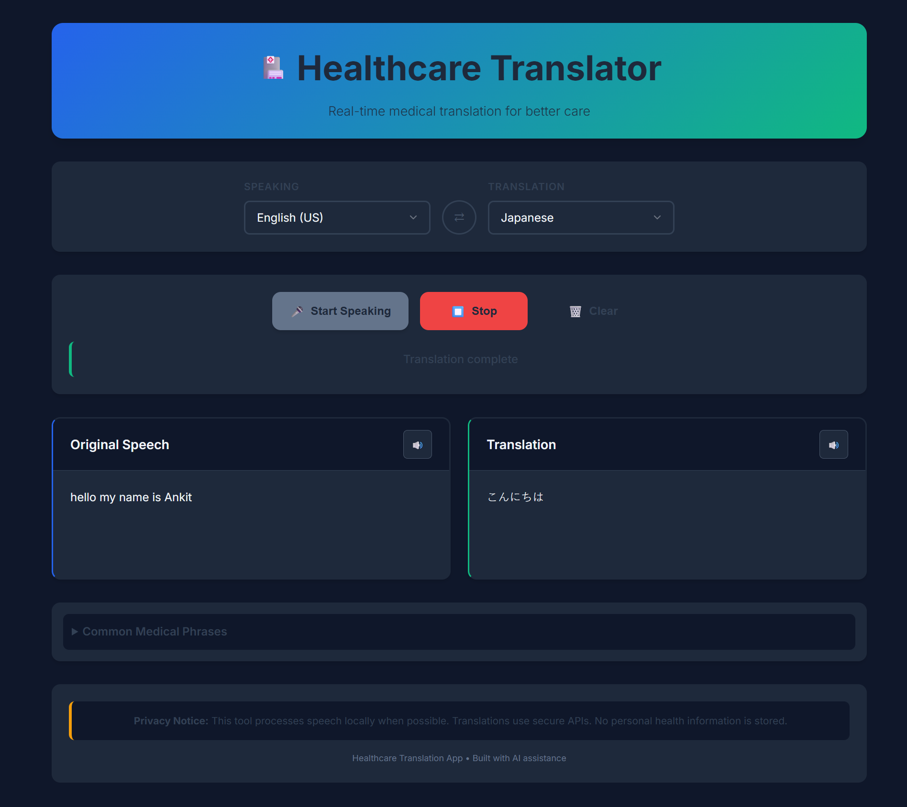

# AI Healthcare Translator 🏥

A real-time, multilingual healthcare translation web application that enables seamless communication between patients and healthcare providers using AI-powered translation and speech recognition.

## 🚀 Deployed Application: [https://ai-healthcare-translator.vercel.app](https://ai-healthcare-translator.vercel.app)



## 🌟 Features

### Core Functionality
- **Voice-to-Text Recognition**: Real-time speech recognition with medical terminology optimization
- **AI-Powered Translation**: Advanced translation using Google Gemini API for medical accuracy
- **Text-to-Speech Playback**: Audio playback of both original and translated text
- **Dual Transcript Display**: Side-by-side view of original speech and translations
- **Mobile-First Design**: Responsive interface optimized for tablets and smartphones

### User Experience
- **11 Language Support**: English, Spanish, French, German, Italian, Portuguese, Chinese, Japanese, Korean, Arabic, Hindi
- **Quick Medical Phrases**: Pre-built common medical questions and instructions
- **Language Swap**: One-click language direction switching
- **Keyboard Shortcuts**: Efficient keyboard navigation for healthcare professionals
- **Real-Time Processing**: Instant translation as you speak

### Healthcare-Focused Features
- **Medical Terminology Accuracy**: AI trained to handle medical vocabulary
- **Privacy Protection**: Local processing when possible, secure API usage
- **Error Handling**: Robust error management for critical healthcare scenarios
- **Accessibility**: Screen reader support and keyboard navigation
- **Offline Capabilities**: Basic functionality works without internet

## 🛠️ Technology Stack

- **Frontend**: HTML5, CSS3, JavaScript (ES6+)
- **AI Translation**: Google Gemini API
- **Speech Recognition**: Web Speech API
- **Text-to-Speech**: Web Speech Synthesis API
- **Deployment**: Vercel
- **Styling**: Custom CSS with CSS Grid and Flexbox
- **Security**: Environment variable management, CSP headers

## 📦 Installation & Setup

### Prerequisites
- Modern web browser (Chrome, Firefox, Safari, Edge)
- Microphone access permission
- Internet connection for translations
- Google Gemini API key (for production)

### Local Development

1. **Clone the repository**
   ```bash
   git clone https://github.com/aasthatayal/AI-healthcare-translator.git
   cd AI-healthcare-translator
   ```

2. **Install dependencies**
   ```bash
   npm install
   ```

3. **Set up environment variables**
   ```bash
   # Create .env file
   echo "GEMINI_API_KEY=your_api_key_here" > .env
   ```

4. **Start development server**
   ```bash
   npm run dev
   ```

5. **Open browser**
   Navigate to `http://localhost:3000`

### Deployment

#### Vercel Deployment
1. Fork this repository
2. Connect to Vercel
3. Set environment variable `GEMINI_API_KEY`
4. Deploy automatically

#### Other Platforms
- **Netlify**: Works with static deployment
- **GitHub Pages**: Requires API key management
- **AWS S3**: Static hosting with CloudFront

## 🎯 Usage Guide

### Basic Operation

1. **Select Languages**
   - Choose input language (what you're speaking)
   - Choose output language (translation target)
   - Use swap button (⇄) to reverse languages

2. **Start Translation**
   - Click "Start Speaking" or press `Ctrl+Space`
   - Speak clearly into microphone
   - View real-time transcription
   - See instant translation

3. **Audio Playback**
   - Click speaker icon (🔊) next to transcripts
   - Listen to original or translated audio
   - Adjust device volume as needed

### Advanced Features

#### Quick Medical Phrases
- Expand "Common Medical Phrases" section
- Click any phrase to instantly translate
- Phrases include common questions and instructions

#### Keyboard Shortcuts
- `Ctrl+Space`: Start/Stop listening
- `Ctrl+L`: Swap languages
- `Ctrl+Delete`: Clear transcripts
- `Escape`: Stop all audio/listening

#### Error Recovery
- Check microphone permissions if recognition fails
- Verify internet connection for translations
- Use manual phrase entry if speech recognition isn't working

## 🔒 Security & Privacy

### Data Protection
- **Local Processing**: Speech recognition happens on-device when possible
- **Secure APIs**: All API calls use HTTPS encryption
- **No Data Storage**: No personal health information is stored permanently
- **Privacy Headers**: Security headers prevent common attacks

### Compliance Considerations
- **HIPAA Awareness**: Designed with healthcare privacy in mind
- **Audit Logging**: Consider implementing for medical environments
- **User Consent**: Clear privacy notices provided
- **Data Minimization**: Only necessary data is processed

## 🏥 Medical Use Cases

### Patient Consultations
- Initial intake conversations
- Symptom descriptions
- Treatment explanations
- Discharge instructions

### Emergency Situations
- Rapid triage communication
- Pain assessment
- Allergy inquiries
- Emergency contact information

### Specialized Care
- Medication instructions
- Procedure explanations
- Follow-up care details
- Preventive care education

## 🔧 Configuration

### Language Settings
```javascript
// Add new languages in script.js
this.speechLangMap = {
    'new-lang': 'code',
    // ... existing languages
};
```

### API Configuration
```javascript
// Update API endpoint if needed
const url = `https://generativelanguage.googleapis.com/v1beta/models/gemini-2.5-flash-lite:generateContent`;
```

### Styling Customization
```css
/* Modify CSS variables in style.css */
:root {
    --primary-color: #2563eb;
    --accent-color: #10b981;
    /* ... other variables */
}
```

## 🚨 Troubleshooting

### Common Issues

**Microphone Not Working**
- Check browser permissions
- Ensure HTTPS connection
- Test with other applications

**Translation Errors**
- Verify API key configuration
- Check internet connection
- Review API rate limits

**Audio Playback Issues**
- Check device volume
- Verify browser audio permissions
- Test with different browsers

### Browser Compatibility
- **Chrome**: Full support ✅
- **Safari**: Full support ✅
- **Firefox**: Limited speech recognition ⚠️
- **Edge**: Full support ✅

## 📈 Performance Optimization

### Loading Speed
- Optimized CSS and JavaScript
- Minimal external dependencies
- Efficient API calls

### Memory Usage
- Cleanup of speech recognition objects
- Efficient DOM manipulation
- Garbage collection friendly

### Network Usage
- Compressed API requests
- Cached translation results
- Offline fallback options

## 🤝 Contributing

### Development Setup
1. Fork the repository
2. Create feature branch
3. Make changes
4. Test thoroughly
5. Submit pull request

### Code Standards
- Use ES6+ JavaScript features
- Follow mobile-first CSS approach
- Include comprehensive comments
- Test across browsers

### Feature Requests
- Open GitHub issues for new features
- Provide detailed use cases
- Consider healthcare compliance requirements

## 🙏 Acknowledgments

- **Google Gemini API**: Advanced AI translation capabilities
- **Web Speech API**: Browser-native speech recognition
- **Healthcare Community**: Feedback and requirements guidance
- **Accessibility Guidelines**: WCAG compliance principles

## 📞 Support

For support, issues, or feature requests:
- Open a [GitHub Issue](https://github.com/aasthatayal/AI-healthcare-translator/issues)
- Review the [Documentation](README.md)
- Check [Common Issues](#troubleshooting)

---

**Built with ❤️ for healthcare professionals worldwide**

*This application is designed to assist healthcare communication but should not replace professional medical interpretation services for critical situations.*